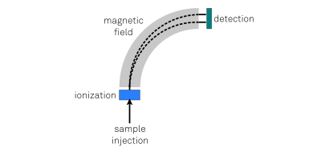

_How liquid chromatography and mass spectrometry work together to help understand molecular structure_

Liquid chromatography and mass spectrometry techniques are useful in identifying what molecules are present in a given sample. The process by which this happens may seem a bit complex if you're not familiar with the subject, so for the sake of the explanation, let's simplify the problem a bit by focusing solely on the mass spectrometry first.

Mass spectrometers aim to measure the mass of individual molecules. Because measuring the mass of something so small is diffucult, mass spectrometers employ a neat trick: instead of measuring the mass directly, they first charge the molecule (so-called _ionization_) and subsequently send it through a constant magnetic field. Because the molecule has been charged, its trajectory won't be a straight line but instead will be a curve. Assuming a unit charge, a lighter molecule's trajectory will be more curved than a heavier molecule's trajectory. When the molecule hits the _detector_ at the end of its trajectory, a light molecule will hit near the bottom of the detector, whereas a heavier molecule will hit nearer the top. This way, you can now use position along the detector surface as a measure of the molecule's mass.

Let's assume that: (1) we know what molecule is injected into the mass spectrometer; (2) there are no other molecules present in the sample

- MS
- why LC before MS
- (LC/MS)^n
 
