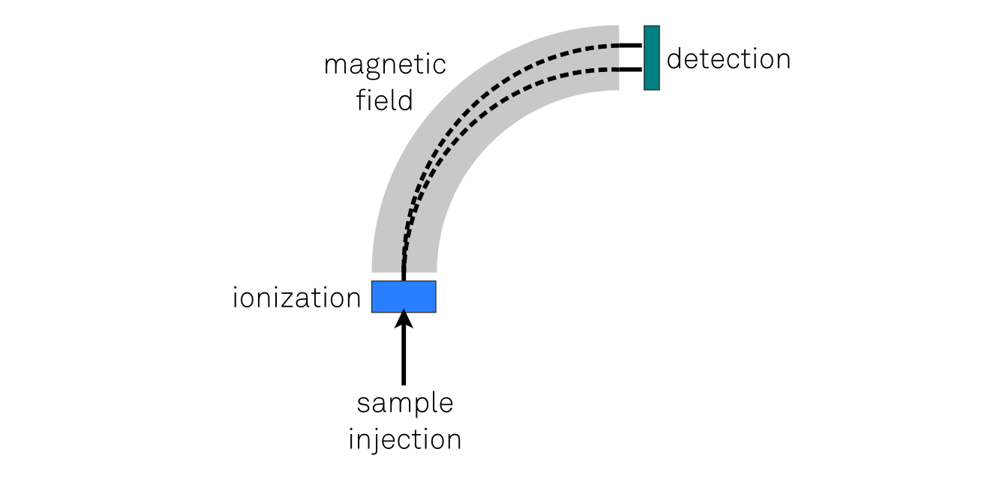

_How liquid chromatography and mass spectrometry can help understand molecular structure_

Liquid chromatography and mass spectrometry techniques are useful in identifying what molecules are present in a given sample. Let's focus on the mass spectrometry first.

Mass spectrometers aim to measure the mass of individual molecules. Because measuring the mass of something so small is diffucult, mass spectrometers employ a neat trick: instead of measuring the mass directly, they first give the molecule an electric charge (so-called _ionization_) and subsequently send it through a magnetic field. Because the molecule is charged, it will experience a force that changes its trajectory. Assuming equal charge (e.g. electron unit), the resulting trajectory depends on the mass of the molecule. There are different designs of MS instruments. In the setup shown below a lighter molecule's trajectory will be more curved than a heavier molecule's trajectory. When the molecule hits the _detector_ at the end of its trajectory, a lighter molecule will hit near the bottom of the detector, whereas a heavier molecule will hit nearer the top. This way, you can now use position along the detector surface as a measure of the molecular mass.

So for example, here's an example of a mass spectrum:

Note that the horizontal axis is labeled _M/z_, the mass-over-charge ratio. This is because it's not guaranteed that the molecule has unit charge (it depends on the experimental setup). The vertical axis is an indication (but not an absolute measure) of how abundant a given mass is. 

The mass spectrum for most compounds has multiple peaks. One of the reasons is that the injected compound may fall apart into so-called _fragments_. Also, a given fragment's constituent atoms may occur as different isotopes, which have slightly different mass. For the spectrum above, here's the explanation of each peak:

- near the right side of the plot, we have a group of mass 44 and a (much less abundant) mass of 45. Since it is the heaviest mass in the sample, it's likely that this group represents the _molecular ion peak_: i.e the injected compound after ionization. However, at this stage we don't know what the mass represents yet.
- the two smallest masses in the spectrum are 12 and 16, suggesting a carbon atom and an oxygen atom, respectively.
- mass-28 likely represents CO, because we just identified mass-12 as C and mass-16 as O.  Furthermore, the molecular ion (mass-44) minus mass-28 (CO) yields a mass of 16 (O). It is therefore likely that the molecular ion represents CO2, carbon dioxide. The smaller peak at mass 45 corroborates this: about 99% of the carbon atoms are carbon-12, but carbon-13 can also occur. So, the peak at mass 45 represents carbon dioxide, where the carbon atom is carbon 13.
- Now we are left with just the peak at mass 22. It's not clear how the other peaks can be combined to yield 22, e.g. 12 + 16 &ne; 22. However, keeping in mind that the horizontal axis says M/z, not just M, it becomes clear that the mass at 22 is simply a molecular ion with a double charge.

So when the initial sample consists of just one type of molecule, most of the time you can figure out what fragment each peak represents, but when we're dealing with things like urine or blood samples, there are simply too many peaks to make any sense of the mass spectrum. So in order to use mass spectrometry in combination with a complex mixture of molecules, we need a way to separate the complex mixture into groups of molecules, i.e. we need _chromatography_. 

_Separating a complex mixture by chromatography_

Chromatography can be _liquid chromatography_ (_LC_) or _gas chromatography_ (_GC_), but the principle is much the same: the complex mixture is diluted by a _solvent_, and then the resulting mixture is introduced into a so-called _column_. The column is basically a small tube filled with _packing material_. The purpose of the packing material is to slow down certain molecules more than others, depending on the molecule's structure, size, and charge. This way, each type of molecule will be associated with a characteristic travel time through the column (the so-called _retention time_): 

By placing the LC before the MS, individual, or at least much smaller numbers of, molecules are simultaneously introduced into the mass spectrometer, which greatly simplifies the MS analysis later on.

