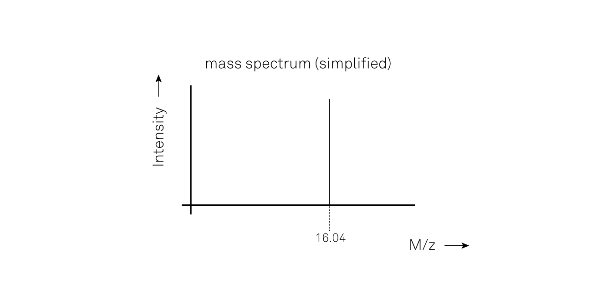

_How liquid chromatography and mass spectrometry can help understand molecular structure_

Liquid chromatography and mass spectrometry techniques are useful in identifying what molecules are present in a given sample. The process by which this happens may seem a bit complex if you're not familiar with the subject, so for the sake of the explanation, let's simplify the problem a bit by focusing solely on the mass spectrometry first.

Mass spectrometers aim to measure the mass of individual molecules. Because measuring the mass of something so small is diffucult, mass spectrometers employ a neat trick: instead of measuring the mass directly, they first charge the molecule (so-called _ionization_) and subsequently send it through a constant magnetic field. Because the molecule has been charged, its trajectory won't be a straight line but instead will be a curve. Assuming a unit charge, a lighter molecule's trajectory will be more curved than a heavier molecule's trajectory. When the molecule hits the _detector_ at the end of its trajectory, a lighter molecule will hit near the bottom of the detector, whereas a heavier molecule will hit nearer the top. This way, you can now use position along the detector surface as a measure of the molecule's mass.

So for example, if we introduce methane (CH4) into the apparatus, the mass spectrum will show a peak at a mass of about 16.04 (because Carbon's molecular mass is 12.01 and Hydrogen's molecular mass is 1.008), like so:

Note that the horizontal axis is labeled _M/z_, the mass-over-charge ratio. This is because it's not guaranteed that the molecule has unit charge (although usually it does). The vertical axis is a measure of how abundant a given mass is. 

It's likely that the mass spectrum will have multiple peaks. This is due to the fact that the molecule may fall apart into so-called _fragments_. For example, a methane molecule can fragment into one CH2 molecule and one H2 molecule. If this happens, the mass spectrum will show two additional peaks:

The fragmentation of CH4 into CH2 and H2 occurs about 1 in 5 times, hence the relative height of the peaks at 2.02 and 14.03 are about 20% of the height of the peak at 16.04.

If other fragments are formed then there will be additional peaks in the mass spectrum. Also, the atoms that make up individual molecules may occur as different isotopes, and will therefore have slightly different mass. Each isotope configuration will have its own peak in the mass spectrum.

The full mass spectrum of methane looks like this:

TODO

So when the initial sample consists of just one type of molecule, most of the time you can figure out what fragment each peak represents, but when we're dealing with things like urine or blood samples, there are simply too many peaks to make any sense of the mass spectrum. So in order to use mass spectrometry in combination with a complex mixture of molecules, we need a way to separate the complex mixture into groups of molecules, i.e. we need chromatography. 

_Separating a complex mixture by chromatography_

Chromatography can be liquid chromatography (_LC_) or gas chromatography (_GC_), but the principle is much the same: the complex mixture is diluted by a _solvent_, and then the resulting mixture is introduced into a so-called _column_. The column is basically a small tube filled with _packing material_. The purpose of the packing material is to slow down certain molecules more than others, depending on the molecules structure, size, and charge. This way, each type of molecule will be associated with a characteristic travel time through the column. 

By placing the LC before the MS, we are able to introduce groups of very similar molecules into the mass spectrometer, thereby greatly simplifying the MS analysis later on.

